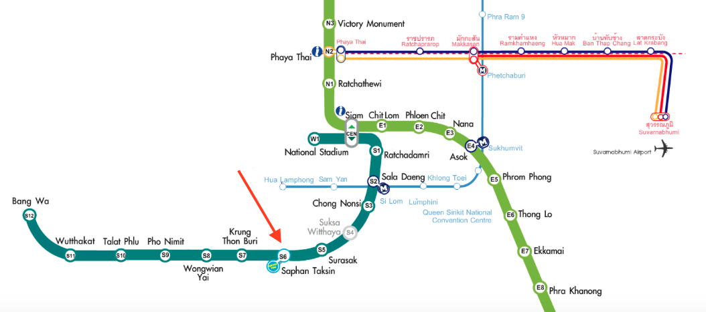

## Halfday Bangkok City Tour | Self Organised | Skytrain and Public Ferry

Understand the Public Transport Map

08:00 AM : Skytrain From BTS Nana to BTS Saphan Taksin  
           Take exit 2 towards the Central Pier (also known as the Sathon Bridge Pier)  
           Take Ferry and get down at Maharaj Pier.  
   
09:00 AM : Grand Palace and Wat Phra Kaeo, or the Temple of the Emerald Buddha   
10:00 AM : Another Ferry ride and get down to Tha Tien (or pier N8)  
           Visit Wat Pho and Wat Arun
11:00 AM : Browse Nearby Market and have Lunch.

01:00 PM : Uber/Grab and back to Airport.
